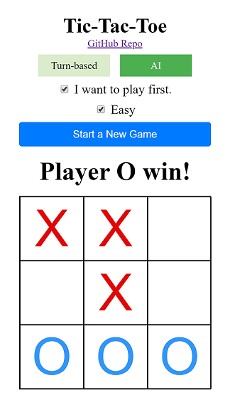

# Angular TicTacToe PWA

A turn-based Tic-Tac-Toe game; and an AI integrated game using minimax algorithm.

## [Demo Progressive Web App](https://changhuixu.github.io/tic-tac-toe/)

## License

Feel free to use the code in this repository as it is under MIT license.

